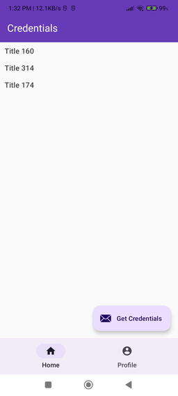
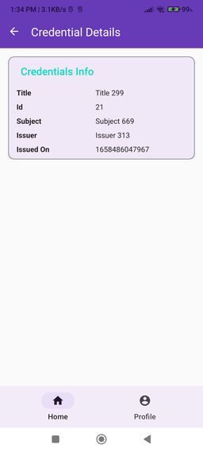
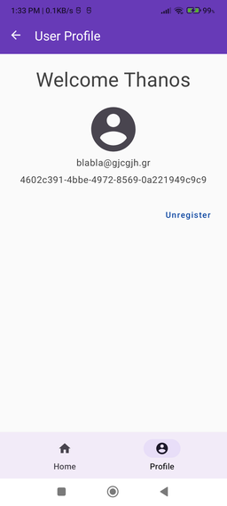

gRPC Playground
======================

The goal of this app is to connect to a server, exchange information using the gRPC protocol and lastly retrieve some mocked credentials issued by the server.

The App fulfills the following criteria:
- A user can create an account by registering to the app using their email, username etc
- After the user has logged in/registered they can request to retrieve certain credential info from server by tapping on the "Get Credentials" Button in the home screen
- There is a basic caching mechanism that stores the credentials received from the server for offline use.
- User can unregister any time. Their stored credentials will be deleted forever.

### Tech stack used.

This app features the following technologies and coding practices.

- gRPC and protocol buffers
- Proto Datastore for local caching
- Koin for Dependency Injection
- Gradle Kotlin DSL scripts
- Clean architecture principles (domain, data, presentation)
- Coroutines for asynchronous calls. Suspending functions and Flows
- A slightly customized MVVM approach. I use ViewModels with StateFlows that emit `sealed` classes as states. The UI decides what to do based on the state received.
- Material Components library

### Running the App

Simply open the project in Android studio. Do not forget to Modify the `ServerConfig.kt` file in order to add your own IP and port number to which the server will be running on. After you build the project, launch the `app` module on Android Studio as usual.

### Running the Server

In order to run the server just execute the following gradle task:

`./gradlew :server:grpcServer`

The above task will first generate the required protocol buffer classes and also run the server all together.

Alternatively you can click the little "Play" icon on the `main()` function residing in `Main.kt` file within the server module through Android Studio. This will also run the server as long as the proto classes have been generated upfront.

### Future goals and improvements

- Improve error handling. Provide more meaningful error messages e.g. for network failures
- Unit tests? Ain't nobody got time for tests.
- Use some form of encryption to store user's credentials.
- Refactor some parts and make general improvements to the code base.
- Migrate to jetpack Compose?
- And More I guess.

### Screenshots

